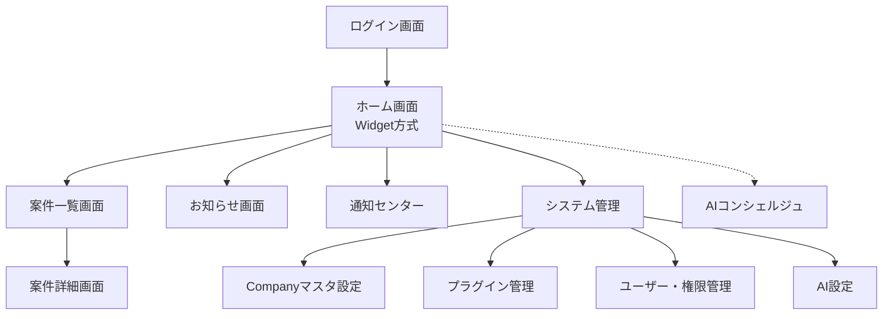

# NAC HUB Ver1.1 設計ドラフト

## 1. 画面一覧

将来的な他社展開・拡張性を見据え、以下のような画面構成とします。

### 認証・共通
- **ログイン画面**
- **ホーム画面（ダッシュボード）**
  - **Widget（ウィジェット）方式**を採用し、天気、予定（カレンダー連携）、案件、タスク、お知らせ等をカード単位で管理・配置（将来的に表示ON/OFF・並び替えに対応）
  - 「最近開いた案件」Widget表示
  - AIコンシェルジュ（なっくん）チャットエリア
  - システム管理者ログイン時の「SYSTEM MODE」表示インジケーター
- **通知センター**
  - 画面上部ベルアイコンから展開。Slack通知、案件更新、システム通知等を集約表示

### 案件管理モジュール
- **案件一覧画面**：ステータス色分け、プログレスバー、カードUI表示
- **案件詳細画面**：進捗、担当、Slack/Drive/NotePMリンク等を集約
  - **タイムライン領域**：案件に関する変更履歴、Slack投稿、コメント等を時系列で確認可能（Ver1は基盤のみ）
- **案件作成・編集モーダル/画面**

### お知らせ・掲示板
- **お知らせ一覧画面**
- **お知らせ詳細画面**

### システム管理・設定（設定駆動）
- **Companyマスタ設定**：会社名、住所、ロゴ、カラー、タイムゾーン、休日等の基本情報
- **プラグイン管理**：Slack, NotePM, Google Drive等の利用プラグインの「ON/OFF」「API設定」「接続確認」を行う画面
- **AI設定**：システムプロンプトの更新・管理画面
- **ユーザー管理**：ユーザー一覧、追加、退職処理（無効化）
- **ロール・権限管理**：役職/ロールの作成、各モジュールの権限割り当て
- **監査ログ・AI実行ログ**：システム変更履歴およびAIの処理・プラグイン利用状況の確認画面
- **システム情報**：バージョン、ビルド番号、更新日の確認画面

---

## 2. 画面遷移図

---

## 3. DB設計 (PostgreSQL)

「設定駆動」「他社展開」「拡張性」および追加要望を網羅したテーブル群です。

### 企業・システム基盤
- **`companies` (Companyマスタ)**: `id`, `name`, `address`, `phone`, `logo_url`, `theme_color`, `timezone`, `holidays` (JSONB)
- **`tenant_settings` (全般設定)**: `id`, `company_id`, `key`, `value`
- **`plugin_configs` (プラグイン管理)**: `id`, `company_id`, `plugin_name`, `is_active`, `config_json`, `last_tested_at`

### ユーザー・権限
- **`roles` (権限ロール)**: `id`, `name`, `permissions` (JSONB)
- **`users` (ユーザー情報)**: `id`, `company_id`, `email`, `password_hash`, `first_name`, `last_name`, `role_id`, `status`

### 案件・タイムライン基盤
- **`projects` (案件情報)**: `id`, `name`, `producer_id`, `progress_rate`, `deadline`, `status`
- **`project_members` (案件メンバー)**: `project_id`, `user_id`, `role`, `created_at`
- **`project_timelines` (案件履歴/タイムライン)**: `id`, `project_id`, `user_id` (null許可), `event_type` (Slack投稿, 納期変更等), `content`, `created_at`

### AI・ログ・通知・履歴
- **`ai_prompts` (AIプロンプト管理)**: `id`, `name` (例: system_default), `prompt_text`, `is_active`
- **`ai_chat_histories` (AIチャット履歴)**: `id`, `user_id`, `question`, `answer`, `created_at`
- **`ai_execution_logs` (AI実行内部ログ)**: `id`, `chat_id`, `used_plugins` (JSONB), `used_data`, `process_details`, `created_at`
- **`notifications` (通知センター)**: `id`, `user_id`, `type`, `title`, `body`, `is_read`, `created_at`
- **`user_favorites` (お気に入り)**: `id`, `user_id`, `target_type` (project, notepm 等), `target_id`
- **`recent_projects` (最近閲覧した案件)**: `id`, `user_id`, `project_id`, `viewed_at`
- **`workflows` (ワークフロー拡張枠)**: `id`, `type`, `status`, `data` (JSONB)
- **`audit_logs` (監査ログ)**: `id`, `user_id`, `action`, `details` (JSONB), `created_at`

---

## 4. アーキテクチャ（プラグイン・アダプター構造）

外部連携部分は**プラグイン（アダプター）パターン**を採用し、管理画面から「ON/OFF」「接続テスト」を行えるようにします。

- **ChatAdapter**: `SlackAdapter`, `TeamsAdapter` 等。
- **AttendanceAdapter**: 今回はHotBizへのリンクやGoogle Calendar API同期を利用しつつインターフェースを定義。
- **StorageAdapter**: `GoogleDriveAdapter` 等。

AI（なっくん）は直接Slack等を叩かず、プラグイン層を通じて安全に情報アクセスし、その過程を `ai_execution_logs` に記録します。

---

## 5. HotBiz連携の方針

Ver1.1ではHotBizの機能を再実装せず、NAC HUBをアクセス拠点（入口）として機能させます。スクレイピングは採用せず、保守性の高い以下の方法を優先します。

1. **タイムカード（打刻）**：リンク遷移
2. **予定表・会議室**：Google Calendar API経由での同期取得（不可の場合はリンク遷移）
3. **設備予約**：リンク遷移
4. **ワークフロー**：リンク遷移（※将来のNAC HUB内実装に向け、`workflows` テーブル等拡張枠を準備）
