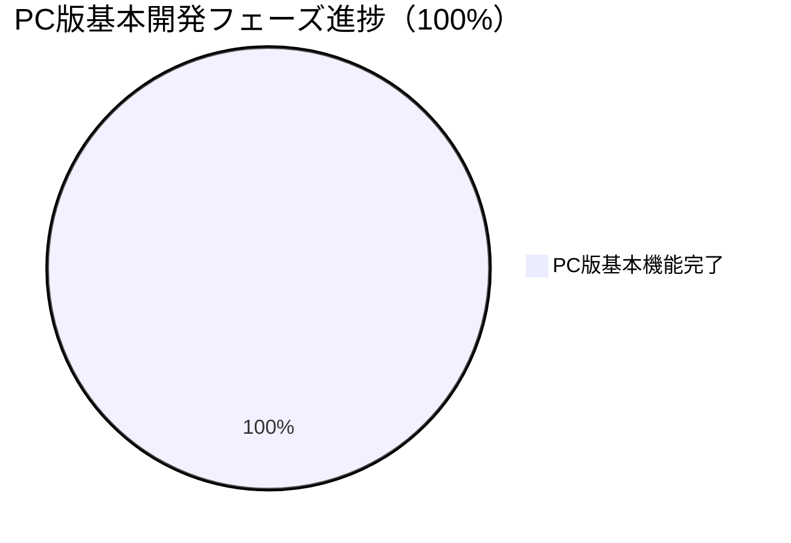

# NAC HUB 開発進捗サマリー

**プロジェクト情報:**
- **プロジェクト名:** NAC HUB
- **バージョン:** 1.3.1 (セキュリティ補正・監査完了)
- **リポジトリパス:** `D:\Antigravity\data\NAC HUB`
- **通常利用URL:** `http://localhost:5173`
- **バックエンドURL:** `http://localhost:8000` (`http://localhost:8000/docs` でSwagger API仕様確認可能)
- **標準動作環境:** Docker Compose (3コンテナ: `nac_hub_frontend`, `nac_hub_backend`, `nac_hub_db`)
- **データベース:** PostgreSQL 15 (alpine)

---

## 全体進捗

> **注釈:** 12/12（100%）は「現在定義されているPC版基本開発フェーズの完了」を意味します。外部連携の本接続（Slack/NotePM/Google Drive/HotBiz/外部AI）や各管理画面の個別API接続、モバイル（スマホ・タブレット）対応は追加開発フェーズとして取り扱います。

| フェーズ | ステータス | 備考 |
|---|---|---|
| プロジェクト初期化 | ✅ 完了 | ディレクトリ構造、docker-compose |
| バックエンド基盤 | ✅ 完了 | FastAPI + SQLAlchemy + Alembic（16テーブル） |
| フロントエンド基盤 | ✅ 完了 | React + Vite + Tailwind CSS |
| 認証・権限 | ✅ 完了 | JWT認証、ロールガード、ログイン/ログアウト（フロント↔バックエンド接続済み） |
| セキュリティ基盤 | ✅ 完了 | 初期パスワード変更強制、ポリシーチェック、監査ログ、**認証情報ローテーション完了** |
| Docker環境 | ✅ 完了 | 3コンテナ正常稼働、ポートフォワーディング解消済 |
| ホーム画面（静的モック） | ✅ 完了 | ウィジェット方式、通知センター、SYSTEM MODE |
| ① なっくんチャットUI | ✅ 完了 | チャットUI本実装 + モックAPI（外部AI API未接続・内部モック回答） |
| ② FastAPIモックAPI連携 | ✅ 完了 | 認証系 + なっくんチャットAPI接続済み |
| ③ 案件管理API | ✅ 完了 | `projects` CRUD API実装（自動テスト11項目全パス） |
| ④ 案件一覧・詳細画面接続 | ✅ 完了 | `Projects.tsx` & `ProjectDetail.tsx` API接続（プロデューサーフィルタ・意味的管理者判定完備） |
| ⑤ ウィジェット動的データ連携 | ✅ 完了 | `GET /api/v1/dashboard` 実装・ホーム画面実データ連携・未接続表示明確化 |

---

## 主な成果と完了事項

### 1. 基盤・認証・セキュリティ補正（完了）
- **JWT 認証:** パスワード暗号化 (`bcrypt`)、アクセストークン発行・検証
- **PostgreSQL 認証情報ローテーション:** 漏洩済み認証情報を強力なランダム値に無害化変更。`.env`, `.env.test` のGit追跡を遮断し、プレースホルダーのみを `.env.example` に保持。
- **コマンド実行方式の保護:** テストコマンドへの `DATABASE_URL` 実値埋め込みを廃止し、テストコード側で `.env.test` を安全自動ロードする構成に標準化。
- **監査ログ (`audit_logs`):** ログイン、パスワード変更、案件登録・更新・削除などの操作を追跡

### 2. なっくんチャット機能（完了）
- なっくんチャットUI (`/chat`)、メッセージ送受信、履歴保持・削除、ログアウト保護
- 自動テスト 21 項目全パス

### 3. 案件管理API & 画面接続（フェーズ③・④：完了）
- `projects`, `project_members`, `project_timelines`, `recent_projects` CRUD API実装
- キーワード検索、ステータスフィルタ、**プロデューサーフィルタ (`GET /api/v1/projects/producers`)**、ページネーション、閲覧履歴自動トラッキング
- 意味的管理者判定 (`user.is_admin === true || role_name === 'admin'`) 完備

### 4. ホーム画面ウィジェット動的連携（フェーズ⑤：完了）
- **集約API:** `GET /api/v1/dashboard` （会社スコープ・ユーザー個別スコープ）
- **実データ連携:** 案件サマリー、最近閲覧した案件、重要なお知らせ、タスク/ワークフロー
- **未接続の明確化:** 出勤状況、HotBiz予定表、天気は「連携準備中/未接続」と明示表示

---

## テスト・検証結果まとめ

| テストスイート / 検証項目 | 内容 | 結果 |
|---|---|---|
| `backend/test_dashboard_api.py` | ダッシュボードAPI・マルチテナント・閲覧履歴 | **100% PASSED** ✅ |
| `backend/test_projects_api.py` | 案件CRUD 11項目 + プロデューサーテスト | **100% PASSED** ✅ |
| `backend/test_api.py` | 21項目 (認証・セキュリティ・チャット) | **100% PASSED** ✅ |
| TypeScript 型チェック (`npx tsc`) | フロントエンド全体型検査 | **0 Error** ✅ |
| フロントエンドビルド (`npm run build`) | Vite プロダクションビルド | **成功 (0 Error)** ✅ |
| フロントエンド Lint (`npm run lint`) | `oxlint` コード品質検証 | **0 Error (9 Warnings)** ✅ |

---

## 現在の残存課題・追加開発項目一覧

PC版基本機能（12フェーズ）は完了しておりますが、本開発および外部システム連携において以下の項目が残存・未接続として定義されています：

1. **画面別個別API接続（残存 UI モック）:**
   - お知らせ画面の個別API接続
   - 通知センター画面の接続状況確認・個別API化
   - ユーザー管理画面のAPI接続
   - ロール・権限管理画面のAPI接続
   - システム設定画面のAPI接続
   - プラグイン管理画面のAPI接続
   - 監査ログ画面のAPI接続
2. **外部サービス連携（本接続）:**
   - HotBiz本接続（現在はリンク集/連携準備中表示）
   - Slack本接続
   - NotePM本接続
   - Google Drive本接続
   - 外部 AI API接続（現在は内部モック回答モード）
   - 外部天気API接続
3. **本番環境・インフラ:**
   - 本番サーバー環境構築・ドメイン/SSL設定
4. **追加開発フェーズ（次工程）:**
   - **追加開発フェーズ5：スマホ・タブレット対応（レスポンシブ最適化）**

---

## 次の作業（追加開発フェーズ）

1. **追加開発フェーズ5：スマホ・タブレット対応（レスポンシブ最適化）**
   - モバイル・タブレット端末におけるレイアウト崩れの修正およびタッチ操作の最適化。
