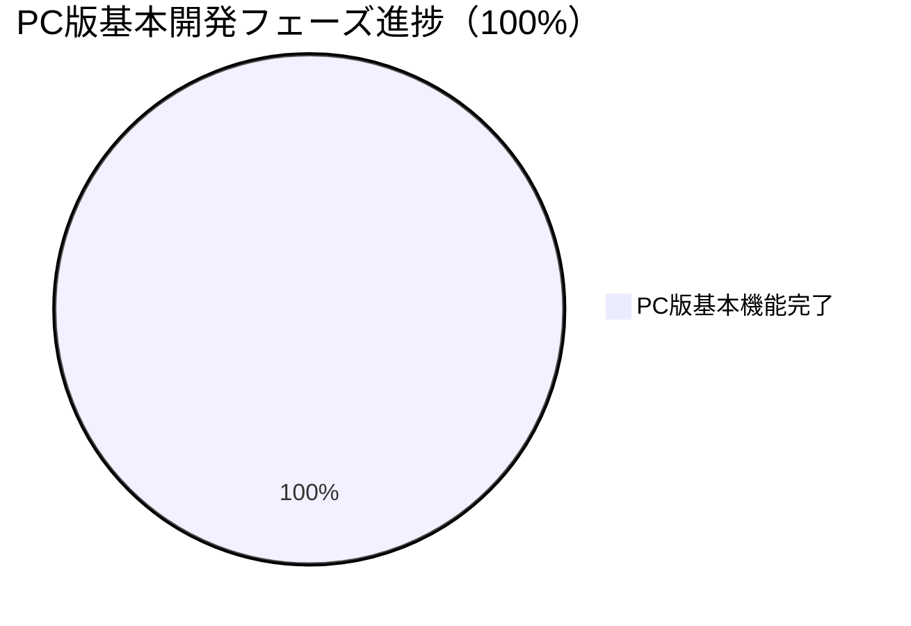

# NAC HUB 開発進捗サマリー

**プロジェクト情報:**
- **プロジェクト名:** NAC HUB
- **バージョン:** 1.3.0
- **リポジトリパス:** `D:\Antigravity\data\NAC HUB`
- **通常利用URL:** `http://localhost:5173`
- **バックエンドURL:** `http://localhost:8000` (`http://localhost:8000/docs` でSwagger API仕様確認可能)
- **標準動作環境:** Docker Compose (3コンテナ: `nac_hub_frontend`, `nac_hub_backend`, `nac_hub_db`)
- **データベース:** PostgreSQL 15 (alpine)

---

## 全体進捗

> **注釈:** 12/12（100%）は「現在定義されているPC版基本開発フェーズの完了」を意味します。外部連携の本接続（Slack/NotePM/Google Drive/HotBiz/外部AI）やモバイル（スマホ・タブレット）対応は追加開発フェーズとして取り扱います。

| フェーズ | ステータス | 備考 |
|---|---|---|
| プロジェクト初期化 | ✅ 完了 | ディレクトリ構造、docker-compose |
| バックエンド基盤 | ✅ 完了 | FastAPI + SQLAlchemy + Alembic（16テーブル） |
| フロントエンド基盤 | ✅ 完了 | React + Vite + Tailwind CSS |
| 認証・権限 | ✅ 完了 | JWT認証、ロールガード、ログイン/ログアウト（フロント↔バックエンド接続済み） |
| セキュリティ基盤 | ✅ 完了 | 初期パスワード変更強制、ポリシーチェック、監査ログ（フロント↔バックエンド接続済み） |
| Docker環境 | ✅ 完了 | 3コンテナ正常稼働、ポートフォワーディング解消済 |
| ホーム画面（静的モック） | ✅ 完了 | ウィジェット方式、通知センター、SYSTEM MODE |
| ① なっくんチャットUI | ✅ 完了 | チャットUI本実装 + モックAPI（外部AI API未接続・内部モック回答） |
| ② FastAPIモックAPI連携 | ✅ 完了 | 認証系 + なっくんチャットAPI接続済み |
| ③ 案件管理API | ✅ 完了 | `projects` CRUD API実装（自動テスト11項目全パス） |
| ④ 案件一覧・詳細画面接続 | ✅ 完了 | `Projects.tsx` & `ProjectDetail.tsx` API接続（プロデューサーフィルタ・意味的管理者判定・補正タグ `v1.2.1` 付与） |
| ⑤ ウィジェット動的データ連携 | ✅ 完了 | `GET /api/v1/dashboard` 実装・ホーム画面実データ連携・未接続表示明確化 |

---

## 主な成果と完了事項

### 1. 基盤・認証・セキュリティ（完了）
- **JWT 認証:** パスワード暗号化 (`bcrypt`)、アクセストークン発行・検証
- **ロール・権限管理:** 意味的管理者判定 (`is_admin`, `role_name`) を導入
- **セキュリティポリシー:** 12文字以上・英大小文字・数字・記号を含む強いパスワード強制、変更履歴チェック
- **監査ログ (`audit_logs`):** ログイン、パスワード変更、案件登録・更新・削除などの操作を追跡

### 2. なっくんチャット機能（完了）
- なっくんチャットUI (`/chat`)、メッセージ送受信、履歴保持・削除、ログアウト保護
- 自動テスト 21 項目全パス

### 3. 案件管理API & 画面接続（フェーズ③・④：完了）
- `projects`, `project_members`, `project_timelines`, `recent_projects` CRUD API実装
- キーワード検索、ステータスフィルタ、**プロデューサーフィルタ (`GET /api/v1/projects/producers`)**、ページネーション、閲覧履歴自動トラッキング
- 意味的管理者判定 (`user.is_admin === true || role_name === 'admin'`) へのリファクタリング完了

### 4. ホーム画面ウィジェット動的連携（フェーズ⑤：完了）
- **新規集約API:** `GET /api/v1/dashboard` を実装（会社単位スコープ、ユーザー単位スコープを厳格に適用）
- **実データ連携ウィジェット:**
  - 案件サマリー（全件、正常、注意/遅延、7日以内近日期限）
  - 最近閲覧した案件（`recent_projects` DBレコードより取得、クリックで詳細へ遷移）
  - 重要なお知らせ（`notifications` DBレコードより取得）
  - タスク / ワークフロー（`workflows` DBレコードより取得）
  - なっくんヒーロー（ログイン中ユーザー名、時間帯別挨拶、`/chat` への入力遷移）
- **未接続の明示化:**
  - 出勤状況: 「出勤管理システム連携準備中」と明確に表示
  - HotBiz予定表: 「HotBiz予定表は連携準備中です」と明確に表示
  - 天気: 「天気情報は未接続です」と明確に表示

---

## フロントエンド↔バックエンド接続状況

| 画面名 | 接続ステータス | 接続API |
|---|---|---|
| ログイン画面 | ✅ 接続済み | `POST /api/v1/auth/login` |
| パスワード変更画面 | ✅ 接続済み | `POST /api/v1/auth/change-password` |
| なっくんチャット画面 | ✅ 接続済み | `POST /api/v1/ai/chat`, `GET/DELETE /api/v1/ai/history` |
| 案件一覧画面 | ✅ 接続済み | `GET /api/v1/projects`, `POST /api/v1/projects`, `GET /api/v1/projects/producers` |
| 案件詳細画面 | ✅ 接続済み | `GET/PUT/DELETE /api/v1/projects/{id}`, Members/Timelines API |
| ホーム画面 | ✅ 接続済み | `GET /api/v1/dashboard` |
| お知らせ画面 | 🟡 部分モック | 近日個別API連携予定 |
| その他設定・管理画面 | 🟡 静的UIモック | 基盤完成済み・順次個別連携 |

---

## テスト・検証結果まとめ

| テストスイート | 項目数 | 結果 |
|---|---|---|
| `backend/test_dashboard_api.py` | 新規ダッシュボードAPIテスト | **100% PASSED** ✅ |
| `backend/test_projects_api.py` | 11項目 + プロデューサーテスト | **100% PASSED** ✅ |
| `backend/test_api.py` | 21項目 (認証・セキュリティ・チャット) | **100% PASSED** ✅ |
| TypeScript 型チェック (`npx tsc`) | フロントエンド全体 | **0 Error** ✅ |
| フロントエンドビルド (`npm run build`) | Vite プロダクションビルド | **成功 (0 Error)** ✅ |
| ブラウザ E2E 検証 | 20項目 | **全項目 PASS** ✅ |

---

## 次の作業（追加開発フェーズ）

1. **追加開発フェーズ5：スマホ・タブレット対応（レスポンシブ最適化）**
   - モバイル・タブレット端末におけるレイアウト崩れの修正およびタッチ操作の最適化。
