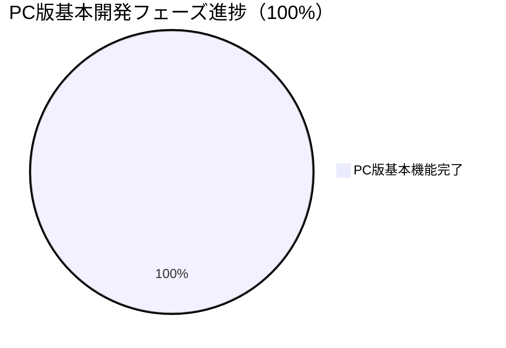

# NAC HUB 開発進捗サマリー

**プロジェクト情報:**
- **プロジェクト名:** NAC HUB
- **バージョン:** 1.4.0 (レスポンシブUI完成・手動E2E PASS)
- **リポジトリパス:** `D:\Antigravity\data\NAC HUB`
- **通常利用URL:** `http://localhost:5173`
- **バックエンドURL:** `http://localhost:8000` (`http://localhost:8000/docs` でSwagger API仕様確認可能)
- **標準動作環境:** Docker Compose (3コンテナ: `nac_hub_frontend`, `nac_hub_backend`, `nac_hub_db`)
- **データベース:** PostgreSQL 15 (alpine)

---

## 全体進捗

> **注釈:** PC版基本開発 12/12（100%）完了に加え、追加開発フェーズ5（スマホ・タブレット対応）も完了。外部連携の本接続（Slack/NotePM/Google Drive/HotBiz/外部AI）や各管理画面の個別API接続、本番サーバー構築は追加開発フェーズとして取り扱う。

| フェーズ | ステータス | 備考 |
|---|---|---|
| プロジェクト初期化 | ✅ 完了 | ディレクトリ構造、docker-compose |
| バックエンド基盤 | ✅ 完了 | FastAPI + SQLAlchemy + Alembic（16テーブル） |
| フロントエンド基盤 | ✅ 完了 | React + Vite + Tailwind CSS |
| 認証・権限 | ✅ 完了 | JWT認証、ロールガード、ログイン/ログアウト（フロント↔バックエンド接続済み） |
| セキュリティ基盤 | ✅ 完了 | 初期パスワード変更強制、ポリシーチェック、監査ログ、全認証情報再ローテーション完了 |
| Docker環境 | ✅ 完了 | 3コンテナ正常稼働、ノーキャッシュ再ビルド環境確立 |
| ホーム画面（静的モック） | ✅ 完了 | ウィジェット方式、通知センター、SYSTEM MODE |
| ① なっくんチャットUI | ✅ 完了 | チャットUI本実装 + モックAPI（外部AI API未接続・内部モック回答） |
| ② FastAPIモックAPI連携 | ✅ 完了 | 認証系 + なっくんチャットAPI接続済み |
| ③ 案件管理API | ✅ 完了 | `projects` CRUD API実装（自動テスト11項目全パス） |
| ④ 案件一覧・詳細画面接続 | ✅ 完了 | `Projects.tsx` & `ProjectDetail.tsx` API接続（プロデューサーフィルタ・意味的管理者判定完備） |
| ⑤ ウィジェット動的データ連携 | ✅ 完了 | `GET /api/v1/dashboard` 実装・ホーム画面実データ連携 |
| **追加フェーズ5：スマホ・タブレット対応** | ✅ **完了** | 全14画面レスポンシブ対応・手動E2E PASS・タグ `v1.4-responsive-ui` 付与 |

---

## 主な成果と完了事項

### 1. 基盤・認証・セキュリティ（完了）
- **JWT 認証:** パスワード暗号化 (`bcrypt`)、アクセストークン発行・検証
- **全認証情報の再ローテーション:** `SECRET_KEY` および `FIRST_SUPERUSER_PASSWORD` を個別のランダム値で再設定
- **管理者認証情報の非公開管理:** Git管理外の `D:\Antigravity\secrets\NAC_HUB\initial_admin_password.txt` にのみ安全保存
- **Dockerクリーン再ビルド:** `requirements.txt` からノーキャッシュ完全構築・自動テスト全件合格

### 2. なっくんチャット機能（完了）
- なっくんチャットUI (`/chat`)、メッセージ送受信、履歴保持・削除
- 自動テスト 21 項目全パス
- **チャット無限ループ・重複送信バグ修正（v1.4で対応）**

### 3. 案件管理API & 画面接続（完了）
- `projects`, `project_members`, `project_timelines`, `recent_projects` CRUD API実装
- キーワード検索、ステータスフィルタ、プロデューサーフィルタ、ページネーション、閲覧履歴自動トラッキング

### 4. ホーム画面ウィジェット動的連携（完了）
- **集約API:** `GET /api/v1/dashboard`
- **実データ連携:** 案件サマリー、最近閲覧した案件、重要なお知らせ、タスク/ワークフロー

### 5. スマホ・タブレット対応（v1.4：完了）
- **モバイルハンバーガーメニュー・ドロワー・背景オーバーレイ**（MockLayout.tsx, Sidebar.tsx）
- **共通UIレスポンシブ化**（Input.tsx, Button.tsx, Modal.tsx, Table.tsx）
- **全14画面レスポンシブ対応**（ホーム、チャット、案件一覧/詳細、各設定画面等）
- **なっくん画像表示修復**（Docker WSL bind mount障害を `wsl --shutdown` + Docker Desktop再起動で解消）
- **チャット無限ループ修正**（useEffect依存関係・hasConsumedInitialQフラグ・sendMessageRef導入）

---

## テスト・検証結果まとめ（v1.4.0）

| テストスイート / 検証項目 | 内容 | 結果 |
|---|---|---|
| `backend/test_dashboard_api.py` | ダッシュボードAPI・マルチテナント・閲覧履歴 | **ALL PASSED ✅** |
| `backend/test_projects_api.py` | 案件CRUD 11項目 + プロデューサーテスト | **ALL PASSED ✅** |
| `backend/test_api.py` | 21項目 (認証・セキュリティ・チャット) | **ALL PASSED ✅** |
| TypeScript 型チェック (`npx tsc`) | フロントエンド全体型検査 | **0 Error ✅** |
| フロントエンドビルド (`npm run build`) | Vite プロダクションビルド | **成功 ✅** |
| フロントエンド Lint (`npm run lint`) | `oxlint` コード品質検証 | **0 Error（警告2件）✅** |
| **390 × 844 スマートフォン手動E2E** | 全画面・全操作確認 | **PASS ✅** |
| **820 × 1180 タブレット手動E2E** | 全画面・全操作確認 | **PASS ✅** |
| **1440 × 900 PC回帰確認** | 従来PC表示の崩れなし確認 | **PASS ✅** |

lint警告（既知・動作影響なし）:
- `AuthContext.tsx` の `useAuth` export（Fast Refresh警告）
- `Header.tsx` の `User` import未使用

---

## 現在の残存課題・追加開発項目一覧

### 画面別個別API接続（残存 UI モック）
1. お知らせ画面の個別API接続
2. 通知センター画面のAPI接続
3. ユーザー管理画面のAPI接続
4. ロール・権限管理画面のAPI接続
5. システム設定画面のAPI接続
6. プラグイン管理画面のAPI接続
7. 監査ログ画面のAPI接続

### 外部サービス連携（本接続）
- HotBiz 本接続（現在はリンク集/連携準備中表示）
- Slack 本接続
- NotePM 本接続
- Google Drive 本接続
- 外部 AI API 接続（現在は内部モック回答モード）
- 外部天気 API 接続

### 本番環境・インフラ
- 本番サーバー環境構築・ドメイン / SSL 設定
- VPN設定
- 社内ネットワーク公開設定

---

## 次の作業（追加開発フェーズ）

上記「残存課題」が次工程となる。優先度は別途協議。
