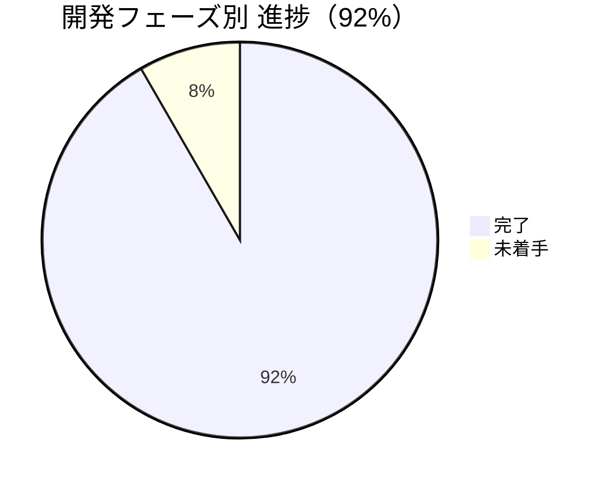

# NAC HUB 開発進捗サマリー

**プロジェクト情報:**
- **プロジェクト名:** NAC HUB
- **バージョン:** 1.2.0
- **リポジトリパス:** `D:\Antigravity\data\NAC HUB`
- **通常利用URL:** `http://localhost:5173`
- **バックエンドURL:** `http://localhost:8000` (`http://localhost:8000/docs` でSwagger API仕様確認可能)
- **標準動作環境:** Docker Compose (3コンテナ: `nac_hub_frontend`, `nac_hub_backend`, `nac_hub_db`)
- **データベース:** PostgreSQL 15 (alpine)

---

## 全体進捗

| フェーズ | ステータス | 備考 |
|---|---|---|
| プロジェクト初期化 | ✅ 完了 | ディレクトリ構造、docker-compose |
| バックエンド基盤 | ✅ 完了 | FastAPI + SQLAlchemy + Alembic（16テーブル） |
| フロントエンド基盤 | ✅ 完了 | React + Vite + Tailwind CSS |
| 認証・権限 | ✅ 完了 | JWT認証、ロールガード、ログイン/ログアウト（フロント↔バックエンド接続済み） |
| セキュリティ基盤 | ✅ 完了 | 初期パスワード変更強制、ポリシーチェック、監査ログ（フロント↔バックエンド接続済み） |
| Docker環境 | ✅ 完了 | 3コンテナ正常稼働、ポートフォワーディング解消済 |
| ホーム画面（静的モック） | ✅ 完了 | ウィジェット方式、通知センター、SYSTEM MODE |
| ① なっくんチャットUI | ✅ 完了 | チャットUI本実装 + モックAPI（外部AI API未接続・内部モック回答） |
| ② FastAPIモックAPI連携 | ✅ 完了 | 認証系 + なっくんチャットAPI接続済み |
| ③ 案件管理API | ✅ 完了 | `projects` CRUD API実装（自動テスト11項目全パス） |
| ④ 案件一覧・詳細画面接続 | ✅ 完了 | `Projects.tsx` & `ProjectDetail.tsx` API接続完了（E2E検証全15項目パス） |
| ⑤ ウィジェット動的データ連携 | ❌ 未着手 | ホーム画面のモックAPI/内部API連携（次の作業） |

---

## 主な成果と完了事項

### 1. 基盤・認証・セキュリティ（完了）
- **JWT 認証:** パスワード暗号化 (`bcrypt`)、アクセストークン発行・検証
- **ロール・権限管理:** `admin` / `user` のアクセス制御
- **セキュリティポリシー:** 12文字以上・英大小文字・数字・記号を含む強いパスワード強制、変更履歴チェック
- **監査ログ (`audit_logs`):** ログイン、パスワード変更、案件登録・更新・削除などの操作を追跡

### 2. なっくんチャット機能（完了）
- なっくんチャットUI (`/chat`)、メッセージ送受信、履歴保持・削除、ログアウト保護
- 自動テスト 21 項目全パス

### 3. 案件管理API（フェーズ③：完了）
- `projects`, `project_members`, `project_timelines`, `recent_projects` CRUD API実装
- 検索、フィルタ、ページネーション、閲覧履歴トラッキング
- テスト専用DB (`nac_hub_test`) にて全11項目自動テストパス

### 4. 案件一覧・詳細画面のAPI接続（フェーズ④：完了）
- **`Projects.tsx`:** モックデータを廃止し `GET /api/v1/projects` へ接続。キーワード検索、ステータスフィルタ (`normal/warning/delayed`)、ページネーション、プロデューサーフィルタ、新規案件作成Modalを完備。
- **`ProjectDetail.tsx`:** `GET /api/v1/projects/{id}` へ接続。基本情報、進捗率、案件編集Modal、管理者限定削除Modal、メンバー配属/削除、タイムライン表示/投稿を完備。存在しない案件IDの 404 ハンドリングも実装。
- **検証結果:** `npm run build` (0エラー)、`test_projects_api.py` (11/11 PASS)、`test_api.py` (21/21 PASS)、E2Eブラウザ確認 (15/15 PASS)。

---

## 現在の実装状況一覧

| カテゴリ | 実装済み内容 |
|---|---|
| **API エンドポイント** | `/health`, `/login`, `/logout`, `/me`, `/admin-only`, `/change-password`, `/ai/chat`, `/ai/history`, `/projects` (CRUD, Members, Timelines) |
| **DB モデル（16テーブル）** | `companies`, `users`, `roles`, `projects`, `project_members`, `project_timelines`, `recent_projects`, `ai_prompts`, `ai_chat_histories`, `ai_execution_logs`, `notifications`, `user_favorites`, `workflows`, `audit_logs`, `tenant_settings`, `plugin_configs` |
| **認証・セキュリティ** | JWT発行/検証、bcryptパスワードハッシュ、管理者ガード、初期パスワード変更強制、パスワードポリシー |
| **画面（14画面）** | ホーム、なっくん(AI)、案件管理、案件詳細、お知らせ、通知センター、HotBizリンク、ユーザー管理、ロール・権限管理、システム設定、プラグイン管理、監査ログ、ログイン、パスワード変更 |

---

## 残りのタスクと次回の予定

1. **フェーズ⑤：ホームウィジェット動的連携（未着手）**
   - ホーム画面 (`Home.tsx`) の各ウィジェット（最近の案件、通知、お気に入り等）を内部APIへ動的接続する。

---

## 補足事項（未実装の外部連携機能について）

以下の機能は、PC版のコア機能が完成した後に実装予定です：
- 外部 AI API（OpenAI / Gemini 等）の実際の接続（現在は内部モック回答モード）
- Slack / NotePM / Google Drive / HotBiz 等の各プラグイン外部API実連携
- 追加開発フェーズ5：スマホ・タブレット等のモバイル最適化レスポンシブデザイン拡張
