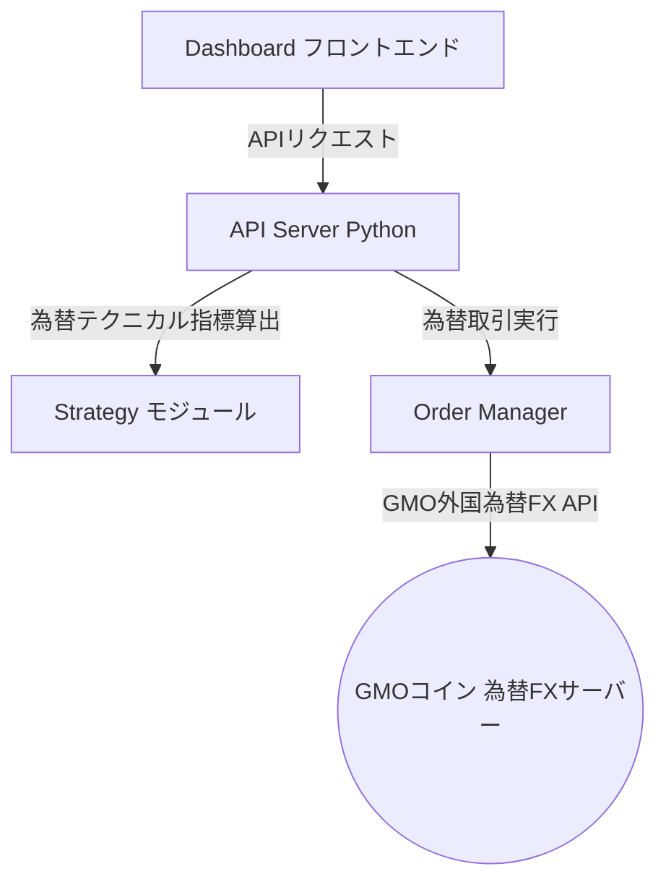

# 為替FX自動取引システムの構築計画

本計画は、現在稼働している暗号資産取引システム「くりぷとくん」をベースにして、別フォルダにてGMOコインの「外国為替FX API」に対応した為替FX自動取引システムを新規に構築することを目的とします。

---

## ユーザー確認事項・オープンクエスチョン

> [!IMPORTANT]
> 構築を進めるにあたり、以下の点についてご意見・ご指定をお願いいたします。

1. **プロジェクトの作成場所について**
   * 現在のプロジェクト `d:\Antigravity\data\trade` とは別の場所に作成します。
   * 例として、親ディレクトリ直下の `d:\Antigravity\data\fx` を想定していますが、このパスでよろしいでしょうか？ （それとも、現在のフォルダ内に `fx` サブフォルダとして作成しますか？）
2. **対象とする通貨ペアについて**
   * 為替FXの取引対象として、まずは最も一般的な **`USD_JPY` (米ドル/円)** を想定していますが、よろしいでしょうか？ 他に取引したい通貨ペア（EUR_JPY, GBP_JPYなど）があればお知らせください。
3. **取引戦略と外部指標について**
   * 暗号資産版で使っていた「Fear & Greed Index (恐怖強欲指数)」はビットコイン固有の指標であるため、為替FXでは使用できません。為替FX版では、**RSIおよびMACDによるテクニカル指標のみ**で判定するか、あるいは他の代替指標を使用するか、どちらがよろしいでしょうか？

---

## 提案するシステム構成

基本的には現在の暗号資産版の美しいダッシュボードとロジック設計（Svelte/HTMLのフロントエンド ＋ Pythonのバックエンド）を継承し、以下の点を外国為替FX向けに変更します。

### 主な変更・新規作成ファイル

#### 1. APIクライアント (`fetchers/market_data.py`) の為替FX版への移行
* ベースURLを暗号資産用の `api.coin.z.com` から、外国為替FX用の **`forex-api.coin.z.com`** に変更します。
* `/v1/openPositions` や `/v1/order` などのエンドポイントの仕様を外国為替FX用（通貨ペアやロット数の仕様）に調整します。

#### 2. 取引マネージャー (`execution/order_manager.py`) の為替FX版への変更
* 為替FXの取引単位（例: USD_JPYは1注文あたり 10,000通貨など）に合わせて、購入ロット数の計算ロジック（`size`）を変更します。

#### 3. 取引戦略 (`strategies/decision_maker.py`) の調整
* Fear & Greed Indexの依存を排除し、為替相場の値動きに適したRSIおよびMACDの判定しきい値を調整します。

#### 4. ダッシュボードのビジュアル調整 (`dashboard/index.html`, `app.js`)
* テーマや配色、タイトル（「くりぷとくん」から「為替FX版（仮称）」など）を変更し、対象通貨を「BTC」から「USD/JPY」などの表示へと変更します。
* 競合を防ぐため、ローカル開発サーバーの起動ポートを **`5001`**（暗号資産版は5000）に設定します。

---

## 移行・構築手順 (予定)

1. 新しいプロジェクトフォルダの作成。
2. 既存の `trade` プロジェクトのソースコード一式を新フォルダにコピー。
3. 仮想環境（`.venv`）の作成と必要な依存パッケージのインストール。
4. 外国為替FX APIのドキュメントに基づくコード修正（APIクライアント、OrderManager、ストラテジー、サーバー、ダッシュボード）。
5. 起動検証およびシミュレーションテスト（ログ確認）。

---

## 検証計画
* 新規フォルダで Python 仮想環境が正しく構築され、サーバーがポート `5001` で正常に起動することを確認します。
* 外国為替FXの資産残高（日本円残高や為替ポジション情報）がダッシュボードに正常に取得・表示されるか確認します。
